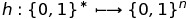
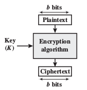
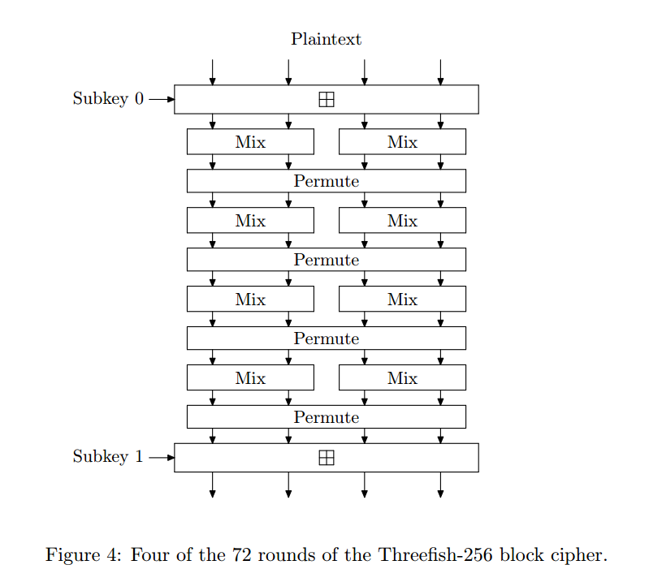
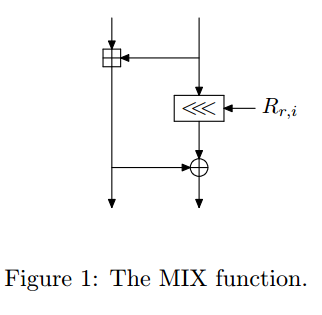
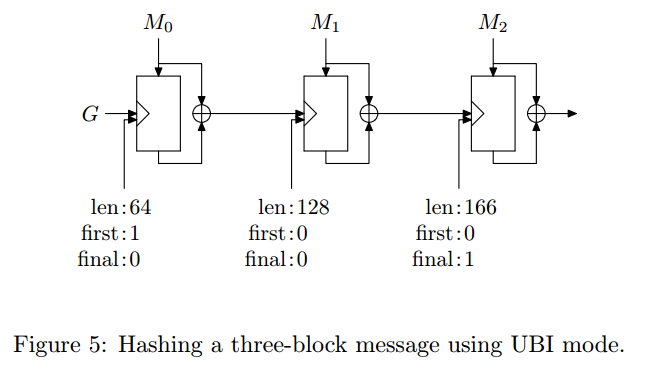
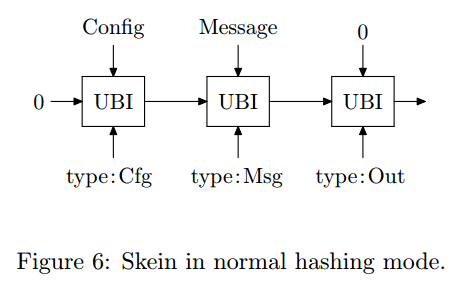

# Skein Hash Function   
Hash functions are the workhorses of cryptography, they are used everywhere: password logins, secure web 
connections, virus and malware scanning, and almost every cryptographic protocol currently used.  
The most commonly used hash functions are those of the SHA family, which were developed by the National 
Security Agency (NSA) and certified by the National Institute for Standards and Technology (NIST).  
Skein is a new family of cryptographic hash functions, which is a submission to the SHA-3 competition.
Its design combines speed, security, simplicity, and a great deal of flexibility in a modular package 
that is easy to analyze. There are Skein 3 variants of Skein - which is defined for three different internal 
state sizes 256 bits, 512 bits, and 1024 bits and any output size.   
In this project work, we implemented the Skein-256 variant of the family. More info can be found at 
[skein-info](http://www.skein-hash.info/).  
## Terminologies:
**Hash function**: a function that can be used to map data of arbitrary size to fixed-size value.  
 - given a message `m`, anyone can compute `h(m)` since 
`h` is public.  
  
  
**Block Cipher**: A block cipher is a method of encrypting text (to produce ciphertext) in which a cryptographic 
key and algorithm are applied to a block of data (for example, 64 contiguous bits) at once as a group 
rather than to one bit at a time.  
  
  
**Threefish**: Skein’s novel idea is to build a hash function out of a tweakable block cipher. Threefish is 
the tweakable block cipher at the core of Skein, defined with a 256-,512-, and 1024-bit block size.  
.  
  
**MIX function**: used in Threefish. It consists of a single addition, a rotation by a constant, and
an XOR.  
 
    
**Unique BLock Iteration (UBI)**: a chaining mode that uses Threefish to build a compression function that
maps an arbitrary input size to a fixed output size.  Figure 5 shows a UBI computation for Skein-512 on a 166-byte (three-block) input,
which uses three calls to Threefish-512.
   
Message blocks M0 and M1 contain 64 bytes of data each, and M2 is the padded final block
containing 38 bytes of data. The tweak value for each block encodes how many bytes have been
processed so far, and whether this is the first and/or last block of the UBI computation. The tweak
also encodes a \type" field|not shown in the figure - that is used to distinguish different uses of
the UBI mode from each other.
  
**Optional Argument System**: This allows Skein to support a variety of optional features
without imposing any overhead on implementations and applications that do not use the
features.  
  
**Skein-256**: a low-memory variant of Skein, as it has 3 different variants: 256, 512 and 1024 bits.  
 